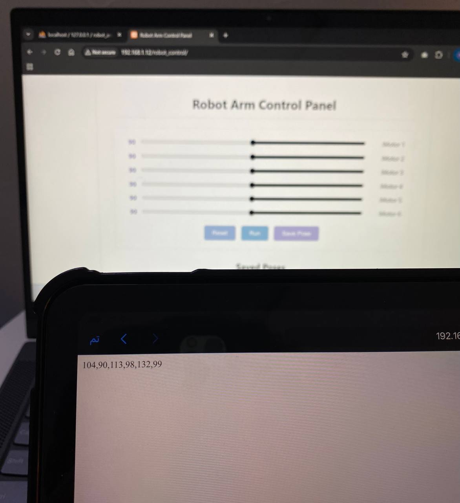

# Robot_Arm_Control_Panel

This project is a web-based control panel for a 6-servo robotic arm, created using XAMPP. It allows users to control servo positions through sliders and save custom poses into a local MySQL database.

## Table of Contents
- [Features](#features)
- [How to Run](#how-to-run)
  - [1. Install XAMPP](#1-install-xampp)
  - [2. Start Apache & MySQL](#2-start-apache--mysql)
  - [3. Create the Database](#3-create-the-database)
  - [4. Add Project Files](#4-add-project-files)
  - [5. Run the Web App](#5-run-the-web-app)
- [Access from Other Devices (ESP32 / Phone / Tablet)](#access-from-other-devices-esp32--phone--tablet)
- [ESP32 Access](#esp32-access)
  - [Step 1: Install ESP32 Board in Arduino IDE](#step-1-install-esp32-board-in-arduino-ide)
  - [Step 2: Test the Board with Blink Example](#step-2-test-the-board-with-blink-example)
  - [Step 3: ESP32 Test Code (GET Request)](#step-3-esp32-test-code-get-request)
  - [Result](#result)


##  Features
- 6 sliders to control servo1 to servo6  
- Save and manage custom poses in a MySQL database  
- Clean web interface using HTML, CSS, JS, and PHP  
- Built on a local server using XAMPP  
- Can be accessed from other devices (like a **phone**, **tablet**, or even an **ESP32**) using the local IP of the XAMPP server

##  How to Run 

### 1. Install XAMPP
- Download from: [https://www.apachefriends.org](https://www.apachefriends.org)
- Install it and open the **XAMPP Control Panel**

### 2. Start Apache & MySQL
- In the control panel, start:
  - **Apache**
  - **MySQL**

### 3. Create the Database
- Go to: `http://localhost/phpmyadmin`
- Create a new database named: `robot_arm`
- Create the following two tables manually:

#### Table: `pose`

| Column   | Type    | Attributes                  |
|----------|---------|-----------------------------|
| id       | INT     | PRIMARY KEY, AUTO_INCREMENT |
| servo1   | INT     |                             |
| servo2   | INT     |                             |
| servo3   | INT     |                             |
| servo4   | INT     |                             |
| servo5   | INT     |                             |
| servo6   | INT     |                             |

#### Table: `run`

| Column   | Type    | Attributes       |
|----------|---------|------------------|
| servo1   | INT     |                  |
| servo2   | INT     |                  |
| servo3   | INT     |                  |
| servo4   | INT     |                  |
| servo5   | INT     |                  |
| servo6   | INT     |                  |
| status   | TINYINT | Default: 0       |

---

### 4. Add Project Files

Copy the following files into your `htdocs` directory:

```bash
C:
└── xampp
    └── htdocs
        └── robot_control
            ├── db_connection.php
            ├── get_poses.php
            ├── get_run_pose.php
            ├── index.php
            ├── load_pose.php
            ├── remove_pose.php
            ├── run_now.php
            ├── save_pose.php
            ├── update_status.php
            └── style

```

### 5. Run the Web App

- Open your browser and navigate to:  
  `http://localhost/robot-arm-control/` – to control the robotic arm 
  `http://localhost/robot_control/get_run_pose.php` – to fetch the currently active pose

  

---


##  Access from Other Devices (ESP32 / Phone / Tablet)

1. **Get Local IP**  
   - Open Command Prompt and run: `ipconfig`  
   - Copy the `IPv4 Address` (e.g., `192.168.1.100`)

2. **Access from Another Device**  
   - Make sure the device (phone, tablet, etc.) is on the same Wi-Fi network  
   - Open a browser and go to:  
     `http://<local-ip>/robot-arm-control/`

   <br>

   ####  Example Access

   From the same PC:
   

   From an iPad:
   


## ESP32 Access 

If you want to access the control panel from an ESP32 device, follow these steps to set it up in the Arduino IDE:

#### Step 1: Install ESP32 Board in Arduino IDE

1. Open **Arduino IDE**
2. Go to `File` → `Preferences`
3. In the **Additional Board Manager URLs** field, paste this link:  
   `https://dl.espressif.com/dl/package_esp32_index.json`

4. Then go to: `Tools` → `Board` → `Boards Manager`
5. Search for **ESP32 by Espressif Systems**, then click **Install**
6. After installation, go to:  
   `Tools` → `Board` → and select your ESP32 board.  
   For most boards, choose:  
**"WEMOS D1 MINI ESP32"**

####  Step 2: Test the Board with Blink Example

1. Open Arduino IDE  
2. Go to: `File` → `Examples` → `01.Basics` → `Blink`  
3. Select the correct board: **WEMOS D1 MINI ESP32**  
4. Select the correct COM port from `Tools → Port`  
5. Click **Upload**
   
   > The onboard LED should start blinking


####  Step 3: ESP32 Test Code (GET Request)

Once your ESP32 board is working correctly, you can use it to fetch live servo data from your local PHP server.

Here’s a complete example using `WiFi.h` and `HTTPClient.h`:

```cpp
#include <WiFi.h>
#include <HTTPClient.h>

// Replace with your Wi-Fi credentials
const char* ssid = "YOUR_WIFI_NAME";         // ← Your Wi-Fi name (SSID)
const char* password = "YOUR_WIFI_PASSWORD"; // ← Your Wi-Fi password

void setup() {
  Serial.begin(115200);
  Serial.println("🚀 Starting ESP32...");

  // Connect to Wi-Fi
  WiFi.begin(ssid, password);
  Serial.print("Connecting to WiFi");

  // Wait until connected
  while (WiFi.status() != WL_CONNECTED) {
    delay(500);
    Serial.print(".");
  }

  Serial.println();
  Serial.println("✅ WiFi connected!");

  // Send HTTP GET request to the server
  if (WiFi.status() == WL_CONNECTED) {
    HTTPClient http;

    // Replace with your actual local IP and PHP endpoint
    String url = "http://YOUR_LOCAL_IP/robot_control/get_run_pose.php";
    http.begin(url); // Initialize HTTP client

    int httpCode = http.GET(); // Send GET request

    if (httpCode > 0) {
      // If response is OK, print it to Serial Monitor
      String payload = http.getString();
      Serial.println("📦 Server Response:");
      Serial.println(payload);
    } else {
      // If error, print the error
      Serial.print("❌ HTTP Request failed: ");
      Serial.println(http.errorToString(httpCode).c_str());
    }

    http.end(); // Close connection
  }
}

void loop() {
  // Nothing here for now
}
```
#### Result

> Below is an actual screenshot of the ESP32 receiving data from the local PHP server:


